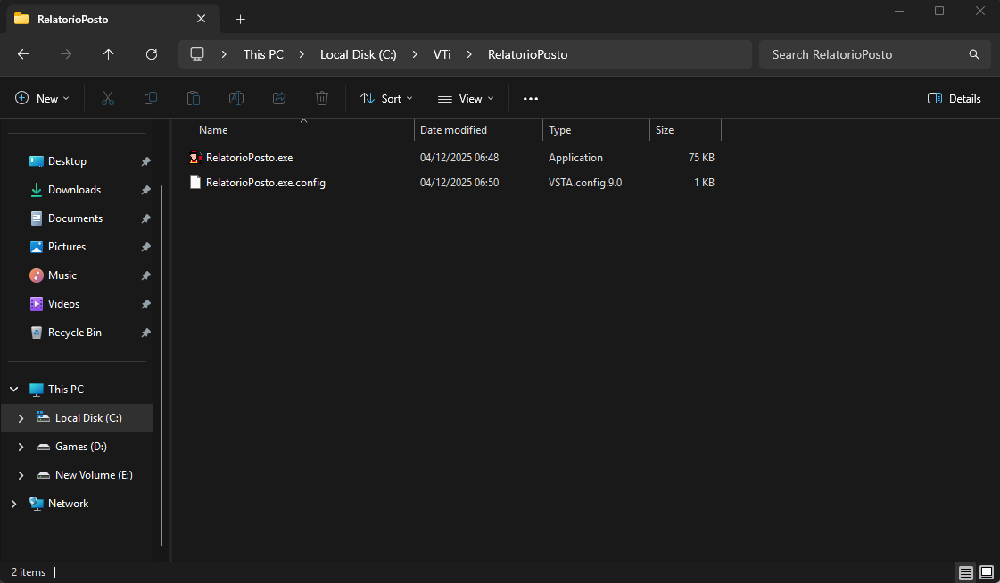
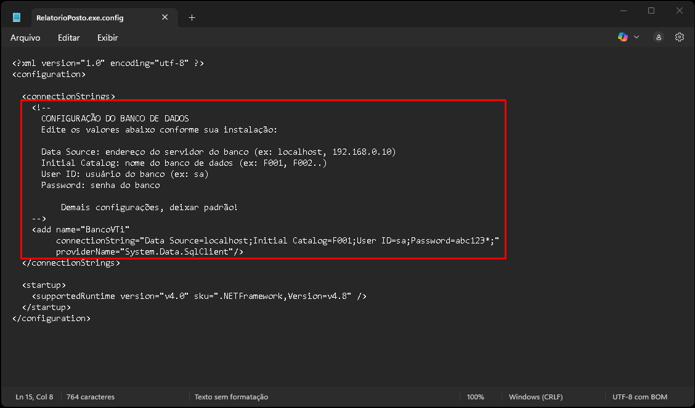
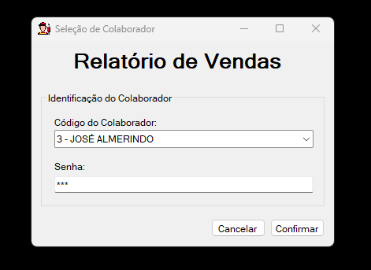
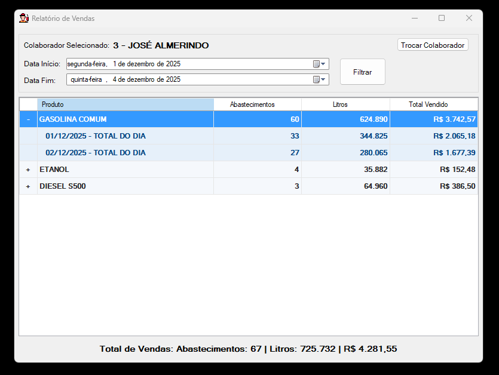

# Relatório Posto

App desenvolvido com o próposito de visualizar o total de abastecimentos de um frentista no sistema VTi, de forma simples e/ou detalhado por dia.

## Instalação

Faça o download da última release pelo link abaixo:

- [Versão 1.0.0](https://github.com/luisfd3v/relatorio-posto/releases/download/v1.0.0/RelatorioPosto-v1.0.0.zip)

Após feito o Download, extraia a pasta compactada.

Recomendo criar uma pasta RelatorioPosto na pasta raiz do VTi, para manter uma organização.

Abra o arquivo .config e edite as informações para configuração do banco de dados caso necessário.

**Importante**

Edite apenas os campos Data Source, Initial Catalog, User ID e Password após o sinal de = .

## Uso/Exemplos

Ao executar o app, irá abrir a tela de login para seleção do colaborador.

Feito o login, será exibido a tela principal do app que terá as seguintes funcionalidades:

- Filtrar pelo periodo desejado (Por padrão Data Início = primeiro dia do mês atual, Data Fim = dia atual do mês atual).

- Expandir para visualizar as vendas detalhadamente.

- Trocar Colaborador (volta para tela de login).

